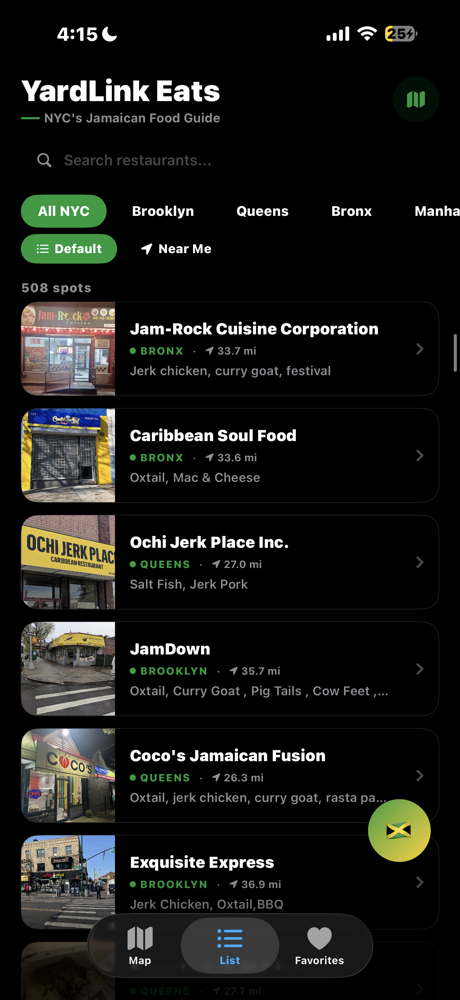
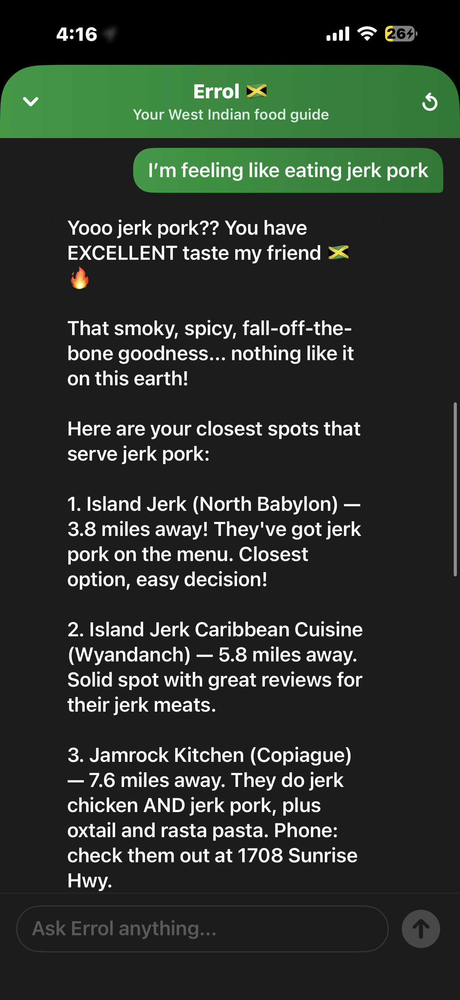
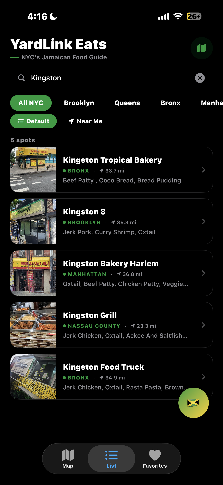
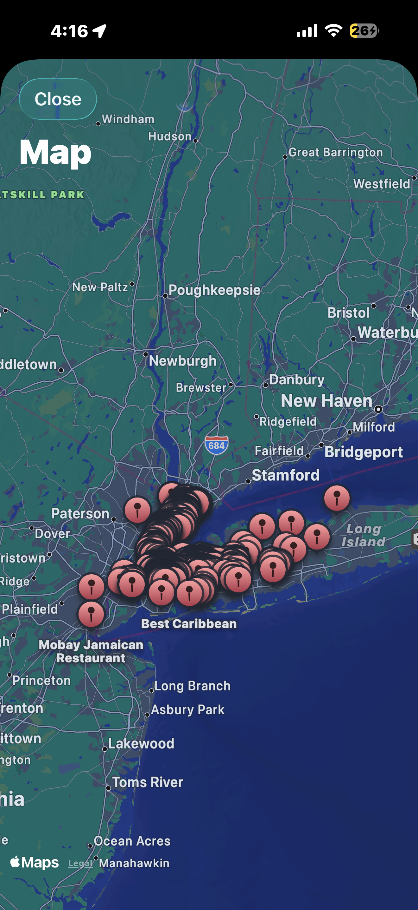

# YardLink Eats

**NYC's premier West Indian restaurant discovery platform — built for the culture.**

`SwiftUI` `Firebase` `Claude AI` `Core Location` `Google Places API` `Netlify` `Python/Flask`

> Built solo. Pre-App Store. Active development.

---

## What It Is

There is no centralized platform for finding authentic Jamaican and West Indian food across New York City. Google Maps buries it. Yelp does not understand it. YardLink Eats fixes that.

A native iOS app backed by a live Firestore database of **508 curated West Indian restaurants** across all five NYC boroughs and Nassau County, Long Island. Every listing has real photos fetched from Google Places, AI-extracted must-try dishes pulled from customer reviews via Claude API, and GPS-based distance from the user's current location. The entire experience is wrapped with **Errol** — a location-aware AI cultural guide built on Claude who knows the difference between a roti shop in Richmond Hill and a jerk spot in the Bronx.

This is not a generic restaurant app with a different color scheme. The data pipeline, the AI context architecture, and the product itself were built from scratch by one person, for one community.

---

## Screenshots

<table>
  <tr>
    <td align="center"><b>Main Screen</b></td>
    <td align="center"><b>Errol AI</b></td>
    <td align="center"><b>Search</b></td>
    <td align="center"><b>Map</b></td>
  </tr>
  <tr>
    <td></td>
    <td></td>
    <td></td>
    <td></td>
  </tr>
  <tr>
    <td align="center">508 spots · Near Me GPS · Must try dishes</td>
    <td align="center">Location-aware AI with real distances</td>
    <td align="center">Instant full-text search</td>
    <td align="center">508 live pins across NYC + Long Island</td>
  </tr>
</table>

---

## Technical Highlights

**End-to-end ownership across mobile, backend, AI, and data engineering — built and shipped solo.**

- Automated Python/Flask scraping pipeline (Anansi) that queries Google Places across 80+ neighborhood-specific targets, deduplicates via MD5 fingerprint, geocodes, and writes structured data to Firestore
- AI enrichment pipeline that fetches Google Places customer reviews, sends to Claude API (`claude-sonnet-4-6`), extracts top must-try dishes per restaurant, and writes structured output back to Firestore — 419 of 441 restaurants enriched in a single pipeline run
- Photo pipeline that fetches from Google Places Photos API, uploads to Firebase Storage, and syncs `photoURL` back to Firestore per restaurant
- Location-aware AI context architecture — user's GPS coordinates injected into Claude's system prompt at request time, with pre-computed distances to all 508 restaurants before every API call. Errol recommends the nearest matching spots by name, neighborhood, and exact mileage
- Serverless proxy pattern via Netlify Functions — Anthropic API key lives server-side in Netlify's environment, never touches the iOS binary, zero credential exposure through App Store submission or binary reverse engineering
- Shared `LocationManager` (`CLLocationManager` wrapper as `ObservableObject`) initialized once in `ContentView` and injected into both `RootView` for Near Me list sorting and `ErrolService` for location-aware prompt assembly — single source of truth for user coordinates across the full app
- Real-time Firestore listener with `approved == true` field gating — unapproved listings are invisible to the iOS app until manually reviewed

---

## Features

- **508 curated West Indian restaurants** — Jamaican, Trinidadian, Guyanese, Barbadian spots across all five boroughs and Nassau County, Long Island
- **Near Me GPS sorting** — one tap sorts all 508 restaurants by real distance from the user's current location, with mileage shown on every card
- **Borough filtering** — Brooklyn, Queens, Bronx, Manhattan, Staten Island, Nassau County chips with real-time Firestore sync
- **Full-text search** — instant search across the entire live database
- **Must Try dishes** — AI-extracted from real Google Places customer reviews via Claude API
- **Real restaurant photos** — fetched from Google Places Photos API, hosted in Firebase Storage
- **Interactive map** — 508 live MapKit pins across NYC and Long Island
- **Favorites** — persistent local favorites via SwiftData and AppStorage
- **Errol** — location-aware AI cultural guide powered by Claude. Knows your exact GPS position. Recommends the nearest matching restaurants with exact distances in natural language

---

## Tech Stack

| Layer | Technology |
|---|---|
| Language | Swift 5.9 |
| UI Framework | SwiftUI |
| Local Persistence | SwiftData |
| Cloud Database | Firebase Firestore |
| Photo Storage | Firebase Storage |
| Maps | MapKit + Core Location |
| AI Model | Anthropic Claude (`claude-sonnet-4-6`) |
| Serverless Backend | Node.js via Netlify Functions |
| Data Pipeline | Python 3 / Flask (Anansi) |
| Photo Pipeline | Google Places Photos API → Firebase Storage → Firestore |
| Must Try Pipeline | Google Places Reviews → Claude API → Firestore |

---

## System Architecture

```
+---------------------------------------------------------------+
|                        iOS App (SwiftUI)                      |
|                                                               |
|   ContentView                                                 |
|   ├── LocationManager (shared ObservableObject)               |
|   │     CLLocationManager wrapper                             |
|   │     feeds RootView + ErrolService simultaneously          |
|   │                                                           |
|   ├── RootView                                                |
|   │     Borough filter chips                                  |
|   │     Full-text search                                      |
|   │     Near Me toggle (GPS sort by distance)                 |
|   │     LazyVStack card list with photos + must try           |
|   │                                                           |
|   ├── FirestoreService                                        |
|   │     Real-time listener                                    |
|   │     approved == true filter                               |
|   │     508 restaurants synced live                           |
|   │                                                           |
|   └── ErrolOverlay                                            |
|         Floating chat UI                                      |
|         Receives Firestore restaurants + GPS location         |
|         ErrolService builds dynamic prompt per request        |
+---|---------------------------|--------------------------------+
    |                           |
    v                           v
+--------------------+   +---------------------------+
| Firebase           |   | ErrolService.swift        |
| Firestore          |   | System prompt includes:   |
| 508 restaurants    |   | - Full 508 restaurant DB  |
| Firebase Storage   |   | - GPS distance per spot   |
| (photos)           |   | - Cultural persona        |
+--------------------+   +-----------+---------------+
                                     |
                                     | HTTPS POST
                                     v
                          +---------------------+
                          | Netlify Serverless  |
                          | errol.js            |
                          | API key server-side |
                          +----------+----------+
                                     |
                                     v
                          +---------------------+
                          | Anthropic Claude    |
                          | claude-sonnet-4-6   |
                          +---------------------+
```

---

## Errol — AI Cultural Guide

Errol is the core engineering differentiator. He is not a generic chatbot with a custom name — the context architecture and real-time location integration are what make him genuinely useful.

**Location-aware recommendation in natural language:**

> **User:** "I'm feeling like eating jerk pork"
>
> **Errol:** "Yooo jerk pork?? You have EXCELLENT taste. That smoky, spicy, fall-off-the-bone goodness — nothing like it. Here are your closest spots that serve jerk pork:
> 1. Island Jerk (North Babylon) — 3.8 miles away
> 2. Island Jerk Caribbean Cuisine (Wyandanch) — 5.8 miles away
> 3. Jamrock Kitchen (Copiague) — 7.6 miles away"

**How the prompt is built per request:**

On every message, `ErrolService.swift` dynamically assembles the system prompt with:

1. **Persona** — culturally fluent, Queens-aware, grounded in Jamaican and West Indian diaspora knowledge
2. **Full database** — all 508 approved restaurant records: name, borough, address, phone, website, must-try dishes
3. **GPS distances** — pre-computed distance from the user's real `CLLocation` to every restaurant in the database, labeled inline

This gives Errol real-time database access and real-time location awareness with no vector search, no RAG pipeline, and no embedding lookup latency. Full context injection at this dataset scale is the most reliable and lowest-latency approach.

**Zero client-side key exposure:**

Every request routes through `errol.js` on Netlify. The Anthropic API key lives in Netlify's server environment. The iOS binary contains no API credentials.

---

## Data Pipeline — Anansi

A custom Python/Flask scraping and enrichment system built alongside the iOS app, with a web dashboard for monitoring pipeline runs.

```
anansi_app.py
    Flask web app with live activity log dashboard
    Queries Google Places Text Search across 80+ neighborhood targets
    Covers all five NYC boroughs + Nassau County, Long Island
    MD5 fingerprint deduplication prevents re-scraping known spots
    Writes to jamaican_restaurants staging collection in Firestore

migrate_restaurants.py
    Schema-validated migration from staging → production collection
    Field allowlist enforcement (only fields the iOS app understands)
    approved defaults to false — every listing requires manual review
    before it appears in the app

fetch_restaurant_photos.py
    Calls Google Places Photos API for each restaurant
    Uploads full-resolution photo to Firebase Storage
    Writes photoURL back to Firestore document

fix_missing_photos.py
    Secondary photo pass for restaurants without Place ID doc IDs
    Searches Google Places by restaurant name + address
    Fills in photos missed by the primary pipeline

enrich_must_try.py
    Fetches up to 5 customer reviews per restaurant from Google Places
    Sends reviews to Claude API with structured extraction prompt
    Claude identifies the 3-5 most praised dishes from real reviews
    Writes comma-separated dish list to mustTry field in Firestore
    Result: 419 of 441 eligible restaurants enriched in one run
```

---

## Project Structure

```
YardLink Eats/
├── ContentView.swift           Root TabView, shared LocationManager, Errol overlay
├── RootView.swift              List view, borough chips, search, Near Me toggle
├── LocationManager.swift       CLLocationManager wrapper, shared ObservableObject
├── Restaurant.swift            Core restaurant model (id, name, borough, coords, etc.)
├── RestaurantModel.swift       SwiftData model with Firestore bridge
├── RestaurantRowView.swift     Premium card UI — photo, borough tag, distance, must try
├── RestaurantDetailView.swift  Hero photo + full restaurant detail view
├── RestaurantMapView.swift     MapKit map with 508 live annotation pins
├── ErrolChatView.swift         Chat UI + floating Jamaican flag overlay button
├── ErrolService.swift          Claude API client, location-aware dynamic prompt builder
├── FavoritesView.swift         Saved restaurants screen
├── FavoritesStore.swift        Favorites persistence via AppStorage
└── FirestoreService.swift      Real-time Firestore listener, approved field filter
```

---

## Getting Started

### Prerequisites

- Xcode 15+
- iOS 17+ target
- Firebase project with Firestore and Storage enabled
- Netlify account for serverless function deployment
- Google Places API key
- Anthropic API key

### Installation

```bash
# 1. Clone
git clone https://github.com/Kevin-Edwards57/yardlink-eats.git

# 2. Add Firebase config
# Drop GoogleService-Info.plist into the YardLink Eats/ directory in Xcode

# 3. Deploy Netlify function
# Copy errol.js to your Netlify functions folder
# Set ANTHROPIC_API_KEY as environment variable in Netlify dashboard

# 4. Update function URL
# In ErrolService.swift, set apiURL to your Netlify deployment URL

# 5. Build and run
# Open YardLink Eats.xcodeproj in Xcode
```

---

## Roadmap

- [x] 508 curated West Indian restaurants across NYC + Nassau County
- [x] Real photos via Google Places → Firebase Storage pipeline
- [x] AI must-try dish extraction from real customer reviews
- [x] GPS Near Me sorting with real-time distance on every card
- [x] Errol location-aware recommendations with exact mileage
- [x] Serverless proxy — zero client-side API key exposure
- [ ] App Store submission
- [ ] Push notifications for nearby featured restaurants (APNs + FCM)
- [ ] Featured listings monetization ($50–150/month per restaurant)
- [ ] Errol context optimization via RAG/embeddings for larger dataset scale
- [ ] Android version (Kotlin — same Firestore backend, no data migration needed)
- [ ] Expansion beyond NYC

---

## Built By

**YardLink Studio** — NYC-based digital agency building websites, mobile apps, and AI tools for small businesses.

[yardlinkstudio.com](https://yardlinkstudio.com) · yardlinkstudio@gmail.com
